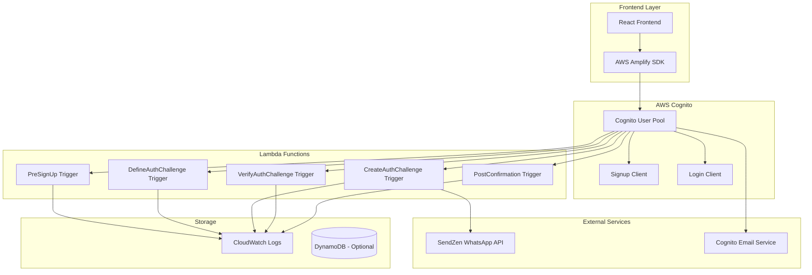
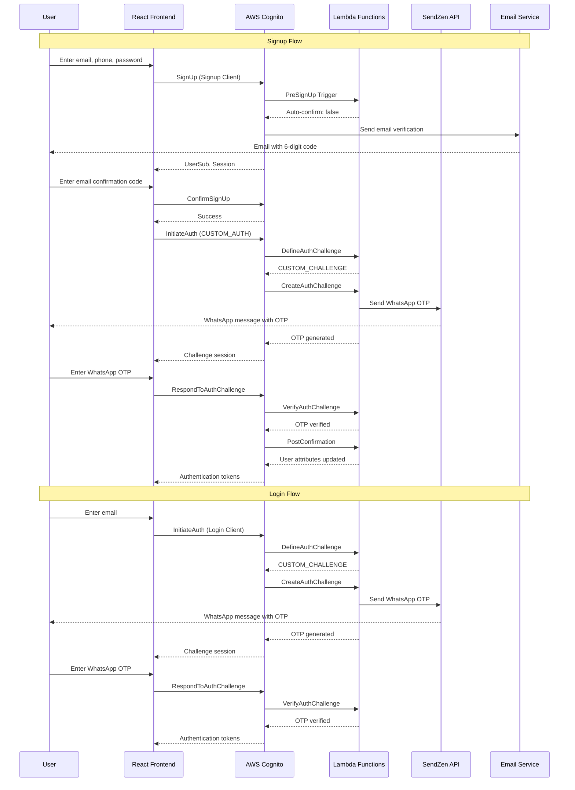
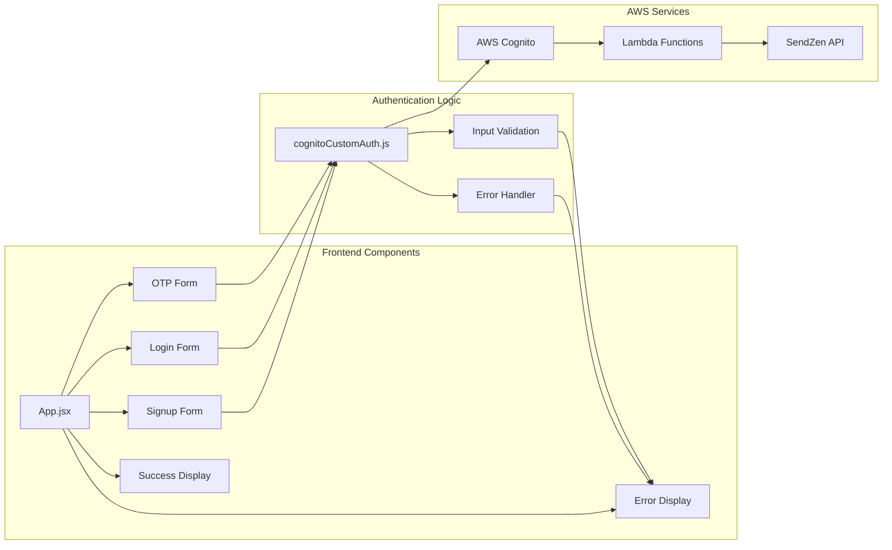
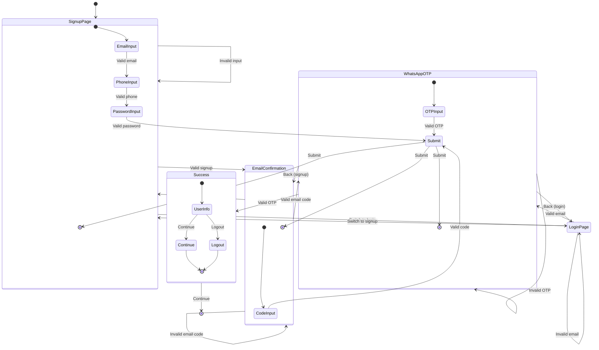
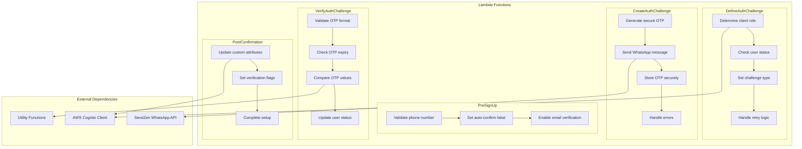
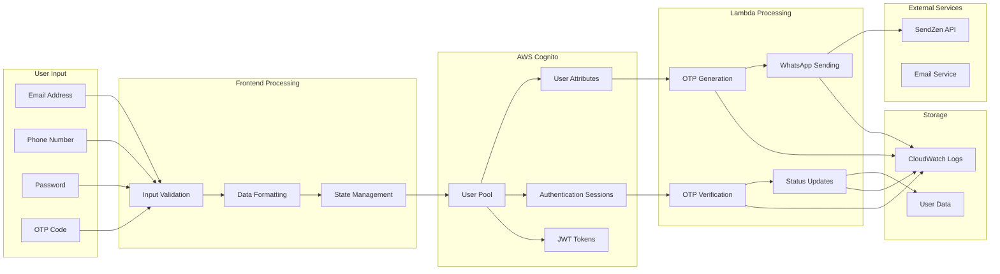
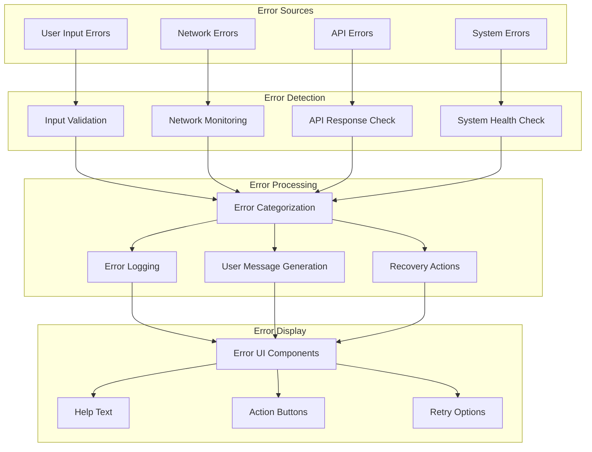
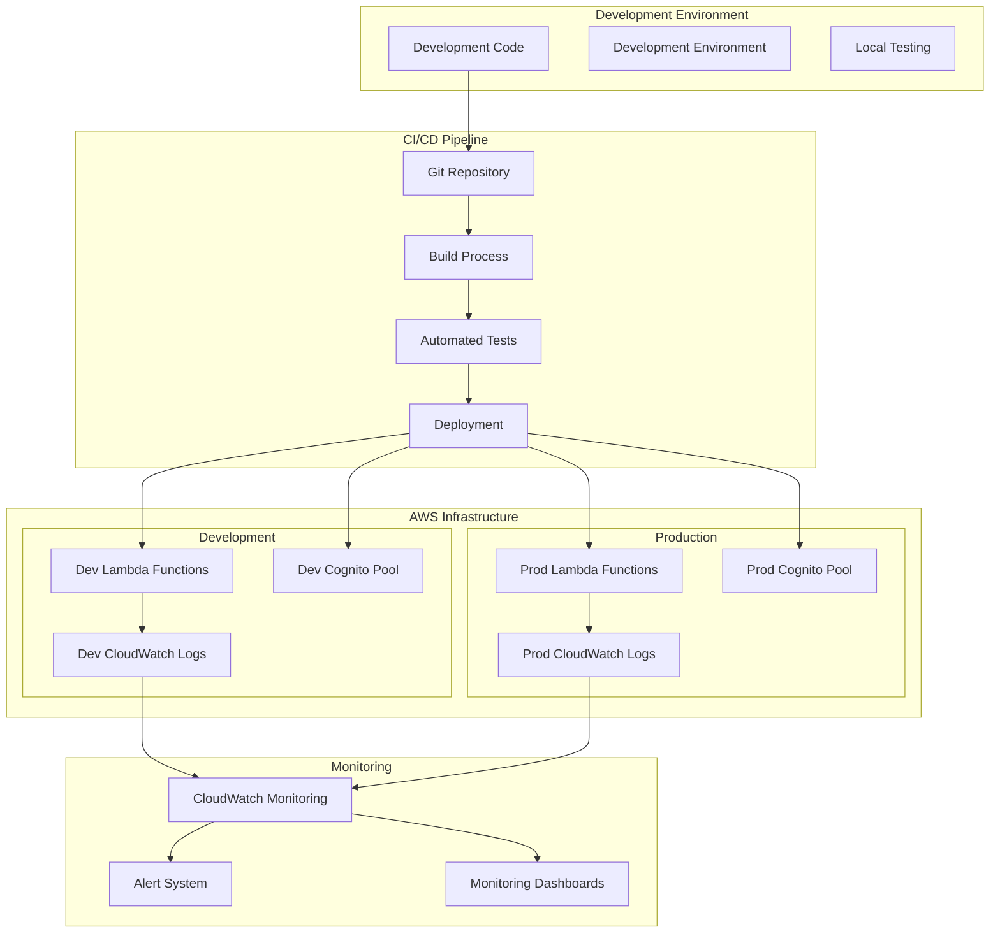
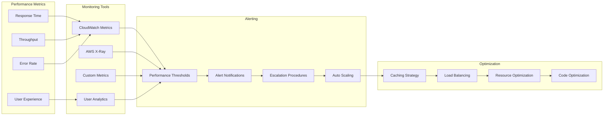

# System Architecture Diagrams

This document contains comprehensive UML diagrams that visualize the WhatsApp-Email Authentication system architecture, components, and flows. These diagrams provide detailed visual documentation of the dual-channel authentication system's architecture, components, and authentication flows.

## 📊 System Overview

The WhatsApp-Email Authentication system implements a sophisticated dual-client authentication flow using AWS Cognito custom authentication triggers and SendZen WhatsApp API integration. This system provides enhanced security through multi-step verification processes and backup authentication methods.

## 🎯 Key Features Visualized

### 🔐 Dual-Channel Authentication
- **Email Verification**: First-step email confirmation process
- **WhatsApp OTP**: Second-step WhatsApp OTP verification
- **Enhanced Security**: Multi-step verification for maximum security
- **Backup Methods**: Alternative verification methods

### 🏗️ Architecture Components
- **AWS Cognito User Pool**: Central authentication management
- **Lambda Functions**: Custom authentication triggers
- **SendZen API**: WhatsApp message delivery
- **Email Service**: AWS Cognito email verification
- **Client Role System**: Separate flows for signup and login

### 📱 User Experience Flows
- **Signup Flow**: Email → WhatsApp verification
- **Login Flow**: Direct WhatsApp OTP verification
- **Error Handling**: Comprehensive error recovery
- **Progress Tracking**: Visual progress indicators

## 🖼️ How to View These Diagrams

The diagrams in this document are written in **Mermaid** syntax. Here are several ways to view them as visual diagrams:

### 1. **GitHub/GitLab (Recommended)**
- GitHub and GitLab automatically render Mermaid diagrams
- Simply view this file in your repository browser
- Diagrams will appear as interactive visual representations

### 2. **VS Code with Mermaid Extension**
```bash
# Install Mermaid Preview extension
# Extension ID: bierner.markdown-mermaid
```
- Open this file in VS Code
- Use `Ctrl+Shift+P` → "Mermaid Preview"
- View diagrams in real-time

### 3. **Online Mermaid Editor**
- Visit [mermaid.live](https://mermaid.live/)
- Copy and paste the diagram code
- View and export as PNG/SVG

### 4. **Mermaid CLI (Command Line)**
```bash
# Install Mermaid CLI
npm install -g @mermaid-js/mermaid-cli

# Generate diagram images
mmdc -i diagram.mmd -o diagram.png
mmdc -i diagram.mmd -o diagram.svg

# Example: Generate architecture diagram
echo 'graph TB
    subgraph "Frontend Layer"
        React[React Frontend]
        Amplify[AWS Amplify SDK]
    end
    
    subgraph "AWS Cognito"
        UserPool[Cognito User Pool]
        SignupClient[Signup Client]
        LoginClient[Login Client]
    end
    
    React --> Amplify
    Amplify --> UserPool
    UserPool --> SignupClient
    UserPool --> LoginClient' > architecture.mmd

mmdc -i architecture.mmd -o architecture.png
```

### 5. **Markdown Editors with Mermaid Support**
- **Typora**: Built-in Mermaid support
- **Mark Text**: Supports Mermaid diagrams
- **Obsidian**: With Mermaid plugin
- **Notion**: Native Mermaid support

### 6. **Browser Extensions**
- **Mermaid Diagrams** (Chrome/Firefox)
- **Markdown Preview Enhanced** (VS Code)

### 7. **Documentation Sites**
- **GitBook**: Native Mermaid support
- **Docusaurus**: With Mermaid plugin
- **VuePress**: With Mermaid plugin
- **MkDocs**: With Mermaid plugin

## 🚀 Quick Start: Viewing Diagrams

### **Easiest Method (GitHub)**
1. Upload this file to a GitHub repository
2. Open the file in GitHub's web interface
3. Diagrams will automatically render as images

### **VS Code Method**
1. Install the "Mermaid Preview" extension
2. Open this file in VS Code
3. Press `Ctrl+Shift+P` and type "Mermaid Preview"
4. View diagrams in the preview pane

### **Online Method**
1. Go to [mermaid.live](https://mermaid.live/)
2. Copy any diagram code from this file
3. Paste it into the editor
4. View the rendered diagram
5. Export as PNG/SVG if needed


## 🏗️ Architecture Diagram

**Purpose**: Complete dual-channel system architecture overview

**Key Components**:
- **Frontend Layer**: React application with AWS Amplify SDK
- **AWS Cognito**: User Pool with dual-client configuration
- **Lambda Functions**: Custom authentication triggers
- **External Services**: SendZen WhatsApp API and Email Service
- **Storage**: CloudWatch logs and optional DynamoDB

**Architecture Features**:
- **Dual-Client Setup**: Separate clients for signup and login flows
- **Email Integration**: AWS Cognito email service for verification
- **WhatsApp Integration**: SendZen API for OTP delivery
- **Monitoring**: Comprehensive CloudWatch logging
- **Scalability**: Serverless architecture with auto-scaling



## 🔄 Authentication Flow Diagram

**Purpose**: Step-by-step dual-channel authentication flow visualization

**Key Flows**:
- **Signup Flow**: Email verification → WhatsApp OTP verification
- **Login Flow**: Direct WhatsApp OTP verification
- **Error Handling**: Comprehensive error scenarios and recovery
- **Timing**: Order and timing of operations

**Flow Features**:
- **Dual-Channel Verification**: Email + WhatsApp OTP
- **Client Role System**: Separate flows for signup and login
- **Enhanced Security**: Multi-step verification process
- **Error Recovery**: Comprehensive error handling
- **State Management**: Authentication state transitions



## 🎯 Component Interaction Diagram

**Purpose**: Frontend component relationships and data flow

**Key Components**:
- **Frontend Components**: React components for user interface
- **Authentication Logic**: Core authentication handling
- **AWS Services**: Backend services and APIs

**Interaction Features**:
- **Component Hierarchy**: Clear component relationships
- **Data Flow**: How data moves through components
- **Error Handling**: Error propagation and display
- **State Management**: Component state interactions
- **Service Integration**: AWS service connections



## 🔐 Security Flow Diagram

**Purpose**: Comprehensive security measures and their relationships

**Key Security Areas**:
- **Input Validation**: Email, phone, password, and OTP validation
- **Authentication Security**: Rate limiting, OTP generation, session management
- **Data Protection**: Encryption, sanitization, XSS/CSRF protection
- **Monitoring**: Logging, monitoring, alerts, and audit trails

**Security Features**:
- **Layered Security**: Multiple security layers for comprehensive protection
- **Input Validation**: Comprehensive validation at all entry points
- **Rate Limiting**: Protection against brute force attacks
- **Secure OTP**: Cryptographically secure OTP generation
- **Session Security**: Secure session management
- **Data Protection**: Encryption and sanitization
- **Monitoring**: Real-time security monitoring
- **Audit Trail**: Complete audit trail for compliance

```mermaid
graph TD
    subgraph "Input Validation"
        EmailVal[Email Validation]
        PhoneVal[Phone Validation]
        PasswordVal[Password Validation]
        OTPVal[OTP Validation]
    end
    
    subgraph "Authentication Security"
        RateLimit[Rate Limiting]
        OTPGen[Secure OTP Generation]
        SessionMgmt[Session Management]
        TokenMgmt[Token Management]
    end
    
    subgraph "Data Protection"
        Encryption[Data Encryption]
        Sanitization[Input Sanitization]
        XSSProtection[XSS Protection]
        CSRFProtection[CSRF Protection]
    end
    
    subgraph "Monitoring"
        Logging[Comprehensive Logging]
        Monitoring[Real-time Monitoring]
        Alerts[Security Alerts]
        Audit[Audit Trail]
    end
    
    EmailVal --> RateLimit
    PhoneVal --> RateLimit
    PasswordVal --> RateLimit
    OTPVal --> RateLimit
    
    RateLimit --> OTPGen
    OTPGen --> SessionMgmt
    SessionMgmt --> TokenMgmt
    
    TokenMgmt --> Encryption
    Encryption --> Sanitization
    Sanitization --> XSSProtection
    XSSProtection --> CSRFProtection
    
    CSRFProtection --> Logging
    Logging --> Monitoring
    Monitoring --> Alerts
    Alerts --> Audit
```

## 📱 User Experience Flow Diagram

**Purpose**: User journey through the dual-channel authentication application

**Key User Flows**:
- **Signup Flow**: Email → WhatsApp verification
- **Login Flow**: Direct WhatsApp OTP verification
- **Error Handling**: Error recovery and retry mechanisms
- **State Transitions**: User state changes and navigation

**UX Features**:
- **Progressive Flow**: Step-by-step authentication process
- **Error Recovery**: Comprehensive error handling and recovery
- **State Management**: Clear state transitions and navigation
- **User Feedback**: Visual feedback and progress indicators
- **Accessibility**: WCAG compliant interface
- **Mobile-First**: Responsive design for all devices



## 🔧 Lambda Function Architecture

**Purpose**: Internal structure of each Lambda function and their processing steps

**Key Lambda Functions**:
- **PreSignUp**: User validation and account setup
- **DefineAuthChallenge**: Authentication flow logic
- **CreateAuthChallenge**: OTP generation and delivery
- **VerifyAuthChallenge**: OTP validation and verification
- **PostConfirmation**: Account finalization

**Function Features**:
- **Modular Design**: Each function has a specific responsibility
- **Error Handling**: Comprehensive error handling in each function
- **External Dependencies**: Integration with AWS services and external APIs
- **State Management**: Proper state transitions and data flow
- **Security**: Secure processing and data handling
- **Monitoring**: Comprehensive logging and monitoring



## 📊 Data Flow Diagram

**Purpose**: How data flows through the dual-channel authentication system

**Key Data Flows**:
- **User Input**: Email, phone, password, and OTP data
- **Frontend Processing**: Validation, formatting, and state management
- **AWS Cognito**: User pool, attributes, sessions, and tokens
- **Lambda Processing**: OTP generation, WhatsApp sending, verification
- **External Services**: SendZen API and email service
- **Storage**: CloudWatch logs and user data

**Data Flow Features**:
- **Input Validation**: Comprehensive validation at all entry points
- **Data Transformation**: Proper data formatting and transformation
- **State Management**: Secure state handling and transitions
- **External Integration**: Secure integration with external services
- **Logging**: Comprehensive logging and monitoring
- **Data Security**: Secure data handling and storage



## 🚨 Error Handling Flow

**Purpose**: Comprehensive error handling strategy for the dual-channel authentication system

**Key Error Sources**:
- **User Input Errors**: Invalid email, phone, password, or OTP
- **Network Errors**: Connectivity issues and timeouts
- **API Errors**: SendZen API and AWS service errors
- **System Errors**: Internal system failures and exceptions

**Error Handling Features**:
- **Error Detection**: Comprehensive error detection at all levels
- **Error Categorization**: Proper error classification and handling
- **Error Logging**: Detailed error logging for debugging
- **User Messages**: User-friendly error messages
- **Recovery Actions**: Automatic and manual recovery options
- **Error Display**: Clear error UI with help and retry options



## 🔄 Deployment Architecture

**Purpose**: CI/CD pipeline and deployment process for the dual-channel authentication system

**Key Deployment Components**:
- **Development Environment**: Local development and testing
- **CI/CD Pipeline**: Automated build, test, and deployment
- **AWS Infrastructure**: Development and production environments
- **Monitoring**: CloudWatch monitoring and alerting

**Deployment Features**:
- **Environment Separation**: Clear separation between dev and prod
- **Automated Pipeline**: CI/CD pipeline for automated deployment
- **Infrastructure as Code**: Serverless Framework for infrastructure management
- **Monitoring**: Comprehensive monitoring and alerting
- **Rollback**: Easy rollback capabilities
- **Security**: Secure deployment practices



## 📈 Performance Monitoring

**Purpose**: Performance monitoring and optimization strategy for the dual-channel authentication system

**Key Performance Areas**:
- **Performance Metrics**: Response time, throughput, error rate, user experience
- **Monitoring Tools**: CloudWatch, X-Ray, custom metrics, user analytics
- **Alerting**: Performance thresholds, notifications, escalation procedures
- **Optimization**: Caching, load balancing, resource optimization

**Monitoring Features**:
- **Real-time Monitoring**: Continuous performance monitoring
- **Alerting**: Proactive alerting for performance issues
- **Auto-scaling**: Automatic scaling based on demand
- **Optimization**: Continuous performance optimization
- **User Experience**: User experience monitoring and optimization
- **Resource Management**: Efficient resource utilization



---

## 📝 Diagram Notes

### Architecture Diagram
- **Purpose**: Complete dual-channel system architecture overview
- **Key Features**: Shows the overall system architecture with all major components
- **Highlights**: Illustrates the flow between frontend, AWS services, and external APIs
- **Separation**: Highlights the separation between signup and login clients
- **Integration**: Shows integration between email and WhatsApp services

### Authentication Flow Diagram
- **Purpose**: Step-by-step dual-channel authentication flow visualization
- **Key Features**: Detailed sequence diagram showing both signup and login flows
- **Interactions**: Includes all interactions between components
- **Timing**: Shows the timing and order of operations
- **Dual-Channel**: Demonstrates email-first, then WhatsApp verification flow

### Component Interaction Diagram
- **Purpose**: Frontend component relationships and data flow
- **Key Features**: Focuses on frontend component relationships
- **Interactions**: Shows how components interact with authentication logic
- **Separation**: Illustrates the separation of concerns
- **Data Flow**: Shows data flow between components

### Security Flow Diagram
- **Purpose**: Comprehensive security measures and their relationships
- **Key Features**: Comprehensive security measures and their relationships
- **Layered Security**: Shows the layered security approach
- **Monitoring**: Includes monitoring and audit capabilities
- **Protection**: Demonstrates multi-layer security protection

### User Experience Flow Diagram
- **Purpose**: User journey through the dual-channel authentication application
- **Key Features**: State diagram showing user journey through the application
- **States**: Includes all possible states and transitions
- **Error Handling**: Shows error handling and recovery paths
- **Progressive Flow**: Demonstrates step-by-step authentication process

### Lambda Function Architecture
- **Purpose**: Internal structure of each Lambda function and their processing steps
- **Key Features**: Internal structure of each Lambda function
- **Processing**: Shows the processing steps within each function
- **Dependencies**: Highlights external dependencies
- **Modularity**: Demonstrates modular function design

### Data Flow Diagram
- **Purpose**: How data flows through the dual-channel authentication system
- **Key Features**: How data flows through the system
- **Flow**: From user input to final storage
- **Transformation**: Shows data transformation and validation points
- **Security**: Demonstrates secure data handling

### Error Handling Flow
- **Purpose**: Comprehensive error handling strategy for the dual-channel authentication system
- **Key Features**: Comprehensive error handling strategy
- **Detection**: From error detection to user feedback
- **Recovery**: Shows recovery mechanisms
- **User Experience**: Demonstrates user-friendly error handling

### Deployment Architecture
- **Purpose**: CI/CD pipeline and deployment process for the dual-channel authentication system
- **Key Features**: CI/CD pipeline and deployment process
- **Environments**: Environment separation
- **Monitoring**: Monitoring and alerting setup
- **Automation**: Shows automated deployment process

### Performance Monitoring
- **Purpose**: Performance monitoring and optimization strategy for the dual-channel authentication system
- **Key Features**: Performance monitoring strategy
- **Metrics**: Metrics collection and analysis
- **Optimization**: Optimization feedback loop
- **Scalability**: Demonstrates auto-scaling and performance optimization

## 🎯 Diagram Usage Guidelines

### For Developers
- **Architecture Understanding**: Use architecture diagrams to understand system design
- **Flow Analysis**: Use sequence diagrams to understand authentication flows
- **Component Mapping**: Use component diagrams to understand infrastructure
- **Deployment Planning**: Use deployment diagrams for deployment planning

### For DevOps
- **Infrastructure Planning**: Use component and deployment diagrams for infrastructure setup
- **Monitoring Setup**: Use architecture diagrams to plan monitoring and logging
- **Security Configuration**: Use security diagrams to plan security measures
- **Environment Management**: Use deployment diagrams for environment management

### For Product Managers
- **User Experience**: Use sequence diagrams to understand user flows
- **Feature Planning**: Use architecture diagrams to plan new features
- **System Understanding**: Use component diagrams to understand system capabilities
- **Risk Assessment**: Use security diagrams to assess security risks

### For Stakeholders
- **System Overview**: Use architecture diagrams for high-level system understanding
- **Business Flow**: Use sequence diagrams to understand business processes
- **Infrastructure Investment**: Use component diagrams to understand infrastructure needs
- **Security Compliance**: Use security diagrams to understand security measures

These diagrams provide a comprehensive visual understanding of the WhatsApp-Email Authentication system, covering architecture, flows, security, and operations. Each diagram serves a specific purpose and provides valuable insights for different stakeholders and use cases.
