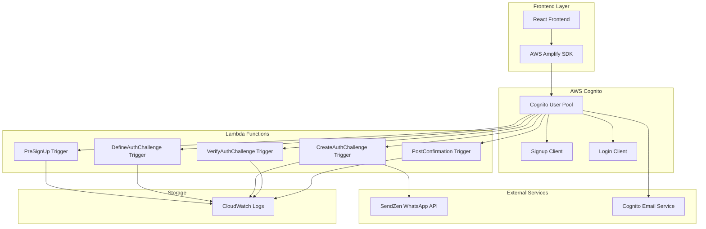
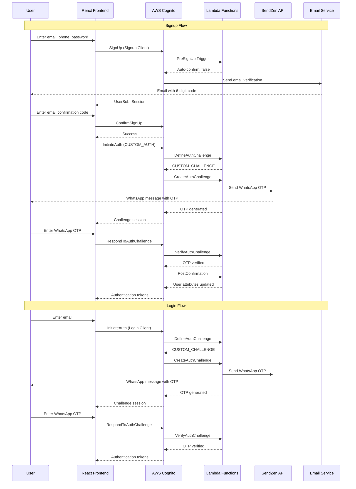

# WhatsApp-Email Authentication Backend

A serverless AWS Cognito custom authentication system that combines email verification with WhatsApp OTP for secure user authentication. This backend provides Lambda triggers for AWS Cognito to handle the complete dual-channel authentication flow.

## 🚀 Overview

This system implements a sophisticated dual-client authentication flow:
- **Signup Flow**: Email verification → WhatsApp OTP verification
- **Login Flow**: Direct WhatsApp OTP verification
- **Enhanced Security**: Multi-step verification process
- **Backup Authentication**: Multiple verification methods

## 🎯 Key Features & Capabilities

### 🔐 Authentication Features
- **Dual-Channel Verification**: WhatsApp OTP + Email confirmation
- **Email-First Flow**: Email confirmation before WhatsApp verification
- **Backup Authentication**: Multiple verification methods for enhanced security
- **Flexible Login**: Login using either phone number or email
- **Enhanced Security**: Multi-step verification process
- **Client Role System**: Separate flows for signup and login
- **Session Management**: Robust session handling with automatic cleanup
- **Rate Limiting**: Built-in protection against brute force attacks

### 📱 WhatsApp Integration Features
- **SendZen API Integration**: Reliable WhatsApp Business API for OTP delivery
- **Template Messages**: Pre-approved message templates for consistent branding
- **Multi-Language Support**: Support for different languages and regions
- **Error Handling**: Graceful API failure handling with retry mechanisms
- **Delivery Tracking**: Comprehensive logging and monitoring of message delivery
- **Template Management**: Easy template configuration and updates
- **Fallback Handling**: Alternative delivery methods when WhatsApp fails

### 📧 Email Integration Features
- **AWS Cognito Email Service**: Built-in email verification
- **Email Templates**: Customizable email templates
- **Delivery Tracking**: Email delivery monitoring
- **Error Handling**: Graceful email failure handling
- **Multi-Language Support**: Support for different languages
- **Template Management**: Easy email template configuration

### 🏗️ Architecture Features
- **Serverless Architecture**: AWS Lambda functions for scalability and cost-effectiveness
- **Cloud-Native**: Built on AWS services (Cognito, Lambda, CloudWatch)
- **Microservices Design**: Modular Lambda functions for maintainability
- **Infrastructure as Code**: Serverless Framework for automated deployment
- **Monitoring & Logging**: CloudWatch integration for observability
- **Auto-Scaling**: Automatic scaling based on demand
- **High Availability**: Multi-AZ deployment for reliability

### 🔒 Security Features
- **Input Validation**: E.164 phone number and email format validation
- **XSS Protection**: Framework built-in XSS protection
- **CSRF Protection**: AWS Cognito's built-in CSRF protection
- **Secure Storage**: Proper token storage with automatic cleanup
- **Audit Trail**: Comprehensive logging for security monitoring
- **Rate Limiting**: Protection against brute force attacks
- **Secret Hash**: HMAC-SHA256 for secure client-server communication
- **Token Security**: Secure JWT token management with automatic expiration

## 🏗️ Architecture Overview

### Key Components

- **AWS Cognito User Pool** with custom authentication triggers
- **Lambda Functions** for authentication challenge handling
- **SendZen API** for WhatsApp message delivery
- **Client Role System** for flow separation
- **Email Service** for email verification
- **Dual-Client Architecture** for enhanced security

### System Architecture



## 📋 Prerequisites

- Node.js 18+ 
- AWS CLI configured with appropriate permissions
- Serverless Framework
- SendZen API account and credentials
- AWS account with Cognito, Lambda, and IAM permissions

## 🚀 Quick Start

### 1. Environment Setup

Copy the environment template:
```bash
cp env.example .env
```

Configure your environment variables:
```env
# AWS Configuration
AWS_REGION=your_preferred_aws_region
AWS_ACCESS_KEY_ID=your_aws_access_key_id
AWS_SECRET_ACCESS_KEY=your_aws_secret_access_key

# SendZen API Configuration
SENDZEN_API_URL=https://api.sendzen.net/v1/messages
SENDZEN_API_KEY=your_sendzen_api_key
WHATSAPP_FROM=your_whatsapp_number
WHATSAPP_TEMPLATE_NAME=your_template_name
WHATSAPP_LANG_CODE=your_language_code

# Optional Configuration
OTP_EXPIRY_MINUTES=5
MAX_LOGIN_ATTEMPTS=3
NODE_ENV=development
LOG_LEVEL=info
COGNITO_USER_POOL_NAME=your_custom_user_pool_name
```

**Important Configuration Notes:**
- **AWS_REGION**: Choose your preferred AWS region (e.g., `us-east-1`, `us-west-2`, `eu-west-1`, `ap-southeast-1`)
- **COGNITO_USER_POOL_NAME**: Choose a unique name for your Cognito User Pool (e.g., `my-app-auth-pool`)
- **WHATSAPP_TEMPLATE_NAME**: Your approved WhatsApp template name from SendZen (e.g., `otp_verification`, `login_code`)
- **WHATSAPP_LANG_CODE**: Language code for your template (e.g., `en_US`, `es_ES`, `fr_FR`, `de_DE`)
- The system will automatically append the stage name to your pool name (e.g., `my-app-auth-pool-dev` for development)

### 2. Install Dependencies

```bash
npm install
```

### 3. Deploy to AWS

```bash
# Deploy to development
npm run deploy:dev

# Deploy to production
npm run deploy:prod
```

### 4. Get Configuration Values

After deployment, note the output values:
- `UserPoolId`
- `SignupUserPoolClientId` 
- `LoginUserPoolClientId`

These will be needed for the frontend configuration.

## 🔧 Configuration

### SendZen WhatsApp Setup

1. Create a SendZen account at [sendzen.net](https://sendzen.net)
2. Get your API key from the dashboard
3. Set up a WhatsApp template with the following structure:
   ```
   Your verification code is {{1}}
   ```
4. Configure the template name and language code in your environment

### AWS Permissions

The deployment requires the following AWS permissions:
- `cognito-idp:*`
- `lambda:*`
- `iam:*`
- `cloudformation:*`
- `logs:*`

## 📁 Project Structure

```
src/
├── types.ts                 # TypeScript type definitions
├── utils.ts                 # Utility functions (OTP generation, WhatsApp API)
├── cognitoClient.ts         # AWS Cognito client configuration
├── clientRole.ts           # Client role determination logic
├── preSignUp.ts            # Pre-signup trigger handler
├── defineAuthChallenge.ts  # Auth challenge definition handler
├── createAuthChallenge.ts  # OTP generation and sending
├── verifyAuthChallenge.ts  # OTP verification handler
└── postConfirmation.ts     # Post-confirmation trigger handler
```

## 🔄 Authentication Flow

### Signup Flow
**Purpose**: Create new user accounts with dual-channel verification (Email + WhatsApp)

**Detailed Steps**:
1. **User Registration**:
   - User enters email, phone number, and password
   - Email format validation and phone number E.164 validation
   - Real-time form validation with immediate feedback
   - Account created with email verification required

2. **Email Verification**:
   - AWS Cognito sends 6-digit verification code to user's email
   - User enters email verification code
   - Email confirmed and account status updated
   - System prepares for WhatsApp verification

3. **WhatsApp OTP Verification**:
   - Custom authentication flow automatically triggered
   - OTP generated and sent via SendZen WhatsApp API
   - User receives WhatsApp message with OTP code
   - User enters OTP to complete dual verification

4. **Account Activation**:
   - Both email and WhatsApp verification completed
   - User attributes updated (email_verified = true, whatsapp_verified = true)
   - Account fully activated with enhanced security
   - JWT tokens issued for authenticated access

### Login Flow
**Purpose**: Authenticate existing users with WhatsApp OTP

**Detailed Steps**:
1. **Email/Phone Input**:
   - User can enter either registered email or phone number
   - Real-time validation and format checking
   - Account existence verification

2. **Account Validation**:
   - System validates account exists and is confirmed
   - User status and verification status checked
   - Account eligibility for login verified

3. **Custom Auth Initiation**:
   - Custom authentication flow triggered
   - DefineAuthChallenge determines challenge type
   - Challenge session established

4. **WhatsApp OTP**:
   - New OTP generated and sent via WhatsApp
   - OTP stored securely with expiry
   - Delivery confirmation logged

5. **OTP Verification**:
   - User enters 6-digit OTP
   - System validates OTP against generated code
   - Verification status updated

6. **Authentication Complete**:
   - JWT tokens issued and stored securely
   - Session established with proper expiration
   - User redirected to authenticated dashboard

### Authentication Flow Diagram



## 🛠️ Lambda Functions

### PreSignUp Trigger
- Validates phone number presence
- Prevents auto-confirmation
- Enables email verification flow

### DefineAuthChallenge Trigger
- Determines authentication flow based on client role
- Manages challenge state transitions
- Handles retry logic and attempt limits

### CreateAuthChallenge Trigger
- Generates cryptographically secure 6-digit OTP
- Sends OTP via SendZen WhatsApp API
- Validates user verification status

### VerifyAuthChallenge Trigger
- Validates OTP against generated code
- Handles OTP expiry and format validation
- Updates user verification status

### PostConfirmation Trigger
- Finalizes user account setup
- Updates custom attributes
- Completes verification process

## 🔐 Security Features

- **Cryptographically Secure OTP**: Uses Node.js crypto module
- **Rate Limiting**: Configurable attempt limits
- **Client Role Separation**: Distinct flows for signup and login
- **Input Validation**: Comprehensive validation at all levels
- **Error Handling**: Detailed error logging and user feedback

## 📊 Monitoring and Logging

### CloudWatch Logs
All Lambda functions log to CloudWatch with structured logging:
- Authentication attempts
- OTP generation and delivery
- Error conditions
- Performance metrics

### Log Levels
- `info`: Normal operations
- `warn`: Non-critical issues
- `error`: Authentication failures
- `debug`: Detailed debugging information

## 🧪 Testing

### Local Testing
```bash
# Run tests
npm test

# Lint code
npm run lint

# Format code
npm run format
```

### Integration Testing
1. Deploy to development environment
2. Test signup flow with real email and WhatsApp
3. Test login flow with existing user
4. Verify error handling scenarios

## 🚨 Error Handling

### Common Error Scenarios

1. **Invalid Phone Number**: E.164 format validation
2. **WhatsApp API Failures**: Network issues, rate limits
3. **OTP Expiry**: 5-minute default expiry
4. **User Not Found**: Account doesn't exist
5. **Verification Status**: Incomplete verification

### Error Response Format
```json
{
  "error": "ERROR_CODE",
  "message": "Human readable message",
  "details": {
    "field": "additional context"
  }
}
```

## 🔄 Deployment

### Development Deployment
```bash
npm run deploy:dev
```

### Production Deployment
```bash
npm run deploy:prod
```

### Environment-Specific Configuration
- Development: Enhanced logging, relaxed limits
- Production: Optimized performance, strict security

## 📈 Performance Optimization

### Lambda Optimization
- **Cold Start**: Minimized dependencies
- **Memory**: Optimized for OTP operations
- **Timeout**: 30-second timeout for API calls
- **Concurrency**: Auto-scaling enabled

### Caching
- **Client Role**: Cached per Lambda container
- **User Attributes**: Minimized Cognito API calls
- **OTP Storage**: In-memory during challenge

## 🔧 Troubleshooting

### Common Issues

1. **WhatsApp API Failures**
   - Check SendZen API credentials
   - Verify WhatsApp number format
   - Check template configuration

2. **Cognito Integration Issues**
   - Verify Lambda permissions
   - Check User Pool configuration
   - Validate client IDs

3. **OTP Delivery Issues**
   - Check phone number format (E.164)
   - Verify WhatsApp registration
   - Check SendZen account status

### Debug Mode
Enable debug logging:
```env
LOG_LEVEL=debug
NODE_ENV=development
```

## 📚 API Reference

### Environment Variables

| Variable | Description | Required | Default |
|----------|-------------|----------|---------|
| `SENDZEN_API_URL` | SendZen API endpoint | Yes | - |
| `SENDZEN_API_KEY` | SendZen API key | Yes | - |
| `WHATSAPP_FROM` | WhatsApp sender number | Yes | - |
| `WHATSAPP_TEMPLATE_NAME` | OTP template name | Yes | `your_template_name` |
| `WHATSAPP_LANG_CODE` | Template language | Yes | `your_language_code` |
| `OTP_EXPIRY_MINUTES` | OTP validity period | No | `5` |
| `MAX_LOGIN_ATTEMPTS` | Max auth attempts | No | `3` |

### Lambda Function Signatures

All Lambda functions follow the AWS Cognito trigger interface:
```typescript
export const handler: TriggerHandler = async (event: TriggerEvent) => {
  // Function implementation
  return event;
};
```

## 📊 System Diagrams

For comprehensive system diagrams including architecture, authentication flows, component interactions, and deployment architecture, see the [DIAGRAMS.md](../DIAGRAMS.md) file.

### 🖼️ How to View Diagrams

The diagrams are written in **Mermaid** syntax. Here are quick ways to view them:

#### **GitHub/GitLab (Easiest)**
- Upload the repository to GitHub/GitLab
- Open [DIAGRAMS.md](../DIAGRAMS.md) in the web interface
- Diagrams render automatically as images

#### **VS Code**
```bash
# Install Mermaid Preview extension
# Extension ID: bierner.markdown-mermaid
```
- Open [DIAGRAMS.md](../DIAGRAMS.md) in VS Code
- Press `Ctrl+Shift+P` → "Mermaid Preview"

#### **Online Editor**
- Visit [mermaid.live](https://mermaid.live/)
- Copy diagram code from [DIAGRAMS.md](../DIAGRAMS.md)
- Paste and view/export as PNG/SVG

### 📋 Available Diagrams

The diagrams include:
- **System Architecture**: Overall system structure and component relationships
- **Authentication Flow**: Detailed sequence diagrams for signup and login flows
- **Component Interaction**: Frontend component relationships and data flow
- **Security Flow**: Security measures and monitoring
- **User Experience Flow**: User journey through the application
- **Lambda Function Architecture**: Internal structure of Lambda functions
- **Data Flow**: Data transformation and validation points
- **Error Handling Flow**: Comprehensive error handling strategy
- **Deployment Architecture**: CI/CD pipeline and deployment process
- **Performance Monitoring**: Performance monitoring and optimization strategy

## 🤝 Contributing

1. Fork the repository
2. Create a feature branch
3. Make your changes
4. Add tests
5. Submit a pull request

## 📄 License

This project is licensed under the MIT License - see the LICENSE file for details.

## 🆘 Support

For support and questions:
- Create an issue in the repository
- Check the troubleshooting section
- Review AWS Cognito documentation
- Consult SendZen API documentation

## 🔄 Version History

- **v1.0.0**: Initial release with dual-client authentication
- **v1.1.0**: Added comprehensive error handling
- **v1.2.0**: Implemented client role system
- **v1.3.0**: Enhanced security and monitoring

---

**Note**: This system requires proper AWS and SendZen configuration. Ensure all environment variables are set correctly before deployment.