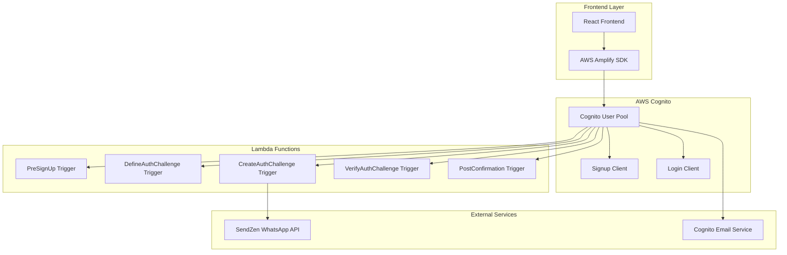
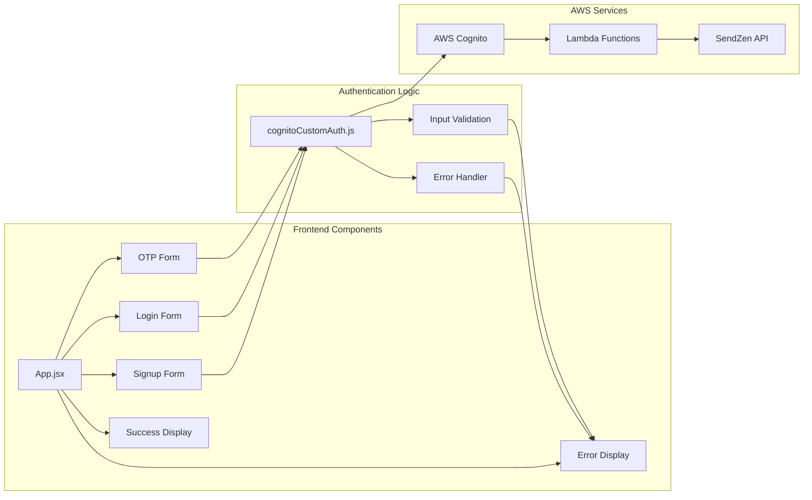
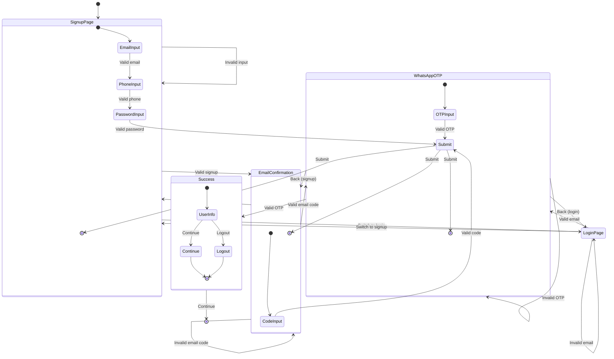

# WhatsApp-Email Authentication Frontend

A React frontend application for WhatsApp-email authentication. Built with Vite, React 18, and AWS Amplify, this application handles both signup and login flows with basic error handling and user feedback.

## Key Features & Capabilities

### Authentication Features
- **Dual Authentication Flow**: Signup and login with WhatsApp OTP
- **Email Verification**: Integrated email confirmation step
- **WhatsApp OTP**: Secure OTP delivery via WhatsApp
- **Dual-Channel Verification**: WhatsApp OTP + Email confirmation
- **Email-First Flow**: Email confirmation before WhatsApp verification
- **Flexible Login**: Login using either phone number or email
- **Session Management**: Basic session handling with AWS Cognito

### Frontend Features
- **Basic UI/UX**: Clean interface with basic design
- **Form Validation**: Client-side form validation
- **Responsive Design**: Basic responsive design for mobile and desktop
- **Error Recovery**: Basic error handling with user messages
- **Loading States**: Visual feedback during authentication processes

### WhatsApp Integration Features
- **OTP Delivery**: OTP delivery via free Sendzen WhatsApp Business API
- **Multi-Language Support**: Support for different template languages
- **Error Handling**: Basic API failure handling

### Email Integration Features
- **Email Verification**: Built-in email verification process
- **Email Templates**: Basic email templates
- **Error Handling**: Basic email failure handling

### Security Features
- **Input Validation**: E.164 phone number and email format validation
- **XSS Protection**: Framework built-in XSS protection
- **CSRF Protection**: AWS Cognito's built-in CSRF protection
- **Secure Storage**: Proper token storage with automatic cleanup
- **Token Security**: Basic JWT token management

### Architecture Features
- **React 18**: Modern React with hooks and functional components
- **Vite**: Fast build tool and development server
- **AWS Amplify**: AWS SDK integration for Cognito
- **CSS3**: Modern styling with CSS Grid and Flexbox
- **ESLint**: Code quality and consistency
- **TypeScript**: Type safety and better development experience

## Architecture

### Technology Stack
- **React 18**: Modern React with hooks and functional components
- **Vite**: Fast build tool and development server
- **AWS Amplify**: AWS SDK integration for Cognito
- **CSS3**: Modern styling with CSS Grid and Flexbox
- **ESLint**: Code quality and consistency

### System Architecture

<details>
<summary>Click to expand system architecture diagram</summary>



</details>

### Component Structure
```
src/
├── components/
│   ├── ErrorBoundary.jsx      # Error boundary wrapper
│   ├── ErrorDisplay.jsx       # Error message display
│   ├── ErrorPanel.jsx         # Error panel component
│   ├── ErrorSystemDemo.jsx    # Error system demonstration
│   ├── LoginMethodSelection.jsx # Login method selection
│   ├── PasswordLogin.jsx      # Password-based login
│   ├── SuccessDisplay.jsx     # Success state display
│   └── UserDetection.jsx      # User detection component
├── contexts/
│   └── ErrorContext.jsx       # Error context provider
├── hooks/
│   └── useErrorHandler.js     # Custom error handling hook
├── App.jsx                    # Main application component
├── App.css                    # Application styles
├── cognitoCustomAuth.js       # AWS Cognito integration
├── index.css                  # Global styles
└── main.jsx                   # Application entry point
```

### Component Interaction

<details>
<summary>Click to expand component interaction diagram</summary>



</details>

## Quick Start

### Prerequisites
- Node.js 18+ 
- npm or yarn
- AWS Cognito User Pool (deployed backend)
- User Pool Client IDs

### 1. Installation

   ```bash
# Clone the repository
git clone <repository-url>
cd whatsapp-email-authentication/react-frontend

# Install dependencies
   npm install
   ```

### 2. Environment Configuration

Copy the environment template:
```bash
cp env.example .env
```

Configure your environment variables:
```env
VITE_AWS_REGION=your_preferred_aws_region
VITE_USER_POOL_ID=your_generated_user_pool_id
VITE_SIGNUP_CLIENT_ID=your_generated_signup_client_id
VITE_LOGIN_CLIENT_ID=your_generated_login_client_id
```

**Example Configuration:**
```env
VITE_AWS_REGION=us-east-1
VITE_USER_POOL_ID=us-east-1_AbCdEfGhI
VITE_SIGNUP_CLIENT_ID=1a2b3c4d5e6f7g8h9i0j1k2l3m4n5o6p
VITE_LOGIN_CLIENT_ID=9z8y7x6w5v4u3t2s1r0q9p8o7n6m5l4k
```

### 3. Development Server

```bash
# Start development server
npm run dev

# Build for production
npm run build

# Preview production build
npm run preview
```

## Configuration

### AWS Cognito Setup

1. **User Pool ID**: Get from backend deployment output
2. **Signup Client ID**: For user registration flow
3. **Login Client ID**: For user authentication flow
4. **AWS Region**: Region where Cognito is deployed

### Environment Variables

| Variable | Description | Required | Example |
|----------|-------------|----------|---------|
| `VITE_AWS_REGION` | AWS region | Yes | `us-east-1` |
| `VITE_USER_POOL_ID` | Cognito User Pool ID | Yes | `us-east-1_AbCdEfGhI` |
| `VITE_SIGNUP_CLIENT_ID` | Signup client ID | Yes | `1a2b3c4d5e6f7g8h9i0j1k2l3m4n5o6p` |
| `VITE_LOGIN_CLIENT_ID` | Login client ID | Yes | `9z8y7x6w5v4u3t2s1r0q9p8o7n6m5l4k` |

## User Interface

### Design Principles
- **Clean and Modern**: Minimalist design with focus on usability
- **Mobile-First**: Responsive design that works on all devices
- **Accessible**: WCAG 2.1 AA compliant
- **Intuitive**: Clear navigation and user flow
- **Feedback-Rich**: Comprehensive error and success messaging

### Color Scheme
- **Primary**: Modern blue gradient
- **Success**: Green for positive actions
- **Error**: Red for errors and warnings
- **Neutral**: Gray scale for text and backgrounds

### Typography
- **Headings**: Bold, clear hierarchy
- **Body Text**: Readable font sizes and line heights
- **Input Labels**: Clear and descriptive
- **Error Messages**: Prominent but not overwhelming

## Authentication Flows

### Signup Flow
**Purpose**: Create new user accounts with dual-channel verification (Email + WhatsApp)

**Detailed Steps**:
1. **Registration Form**:
   - Email address input with validation
   - Phone number input (E.164 format)
   - Password input with strength requirements
   - Form validation and error handling
   - Real-time validation with immediate feedback

2. **Email Verification**:
   - AWS Cognito sends 6-digit verification code to user's email
   - 6-digit code input with auto-focus
   - Resend code functionality with cooldown timer
   - Progress indicator showing current step
   - Error handling for invalid codes
   - Clear instructions and help text

3. **WhatsApp OTP Verification**:
   - Custom authentication flow automatically triggered
   - OTP generated and sent via SendZen WhatsApp API
   - User receives WhatsApp message with OTP code
   - 6-digit code input with paste support
   - Resend OTP functionality with cooldown timer
   - Success confirmation and progress update

4. **Account Activation**:
   - Both email and WhatsApp verification completed
   - User attributes updated (email_verified = true, whatsapp_verified = true)
   - Success message with user information
   - Account fully activated with enhanced security
   - JWT tokens issued for authenticated access
   - Continue to application with full access

### Login Flow
**Purpose**: Authenticate existing users with WhatsApp OTP

**Detailed Steps**:
1. **Email/Phone Input**:
   - User can enter either registered email or phone number
   - Real-time validation and format checking
   - Account existence verification
   - Clear call-to-action and instructions

2. **Account Validation**:
   - System validates account exists and is confirmed
   - User status and verification status checked
   - Account eligibility for login verified
   - Error handling for invalid accounts

3. **WhatsApp OTP Verification**:
   - New OTP generated and sent via WhatsApp
   - OTP delivery to registered number
   - 6-digit code input with auto-focus
   - Resend functionality with cooldown timer
   - Error handling for invalid OTP
   - Progress indicator and status updates

4. **Authentication Success**:
   - JWT tokens issued and stored securely
   - Welcome message with user information
   - Session established with proper expiration
   - User redirected to authenticated dashboard
   - Token refresh mechanism activated

### User Experience Flow

<details>
<summary>Click to expand user experience flow diagram</summary>



</details>

## Components

### Core Components

#### App.jsx
Main application component that manages:
- Authentication state
- Form data
- Error handling
- Flow navigation

#### ErrorBoundary.jsx
React error boundary that catches JavaScript errors and displays fallback UI.

#### SuccessDisplay.jsx
Component for displaying successful authentication states with user information.

### Utility Components

#### ErrorDisplay.jsx
Comprehensive error display with:
- Error categorization
- Helpful suggestions
- Action buttons
- Context-aware messaging

#### ErrorPanel.jsx
Error panel for displaying multiple errors or detailed error information.

### Context Providers

#### ErrorContext.jsx
React context for managing application-wide error state and handling.

## Security Features

### Input Validation
- **Email**: RFC-compliant email validation
- **Phone**: E.164 format validation
- **Password**: Strength requirements
- **OTP**: 6-digit numeric validation

### Error Handling
- **Client-side Validation**: Immediate feedback
- **Server-side Validation**: Comprehensive error messages
- **Rate Limiting**: Protection against brute force
- **Session Security**: Secure token management

### Data Protection
- **No Sensitive Data**: No passwords or tokens in localStorage
- **Secure Communication**: HTTPS-only communication
- **Input Sanitization**: XSS protection
- **CSRF Protection**: AWS Cognito built-in protection


## User Experience

### Loading States
- **Button Loading**: Disabled state with spinner
- **Form Loading**: Overall form loading state

### Error Recovery
- **Clear Instructions**: Step-by-step error resolution
- **Help Text**: Contextual help and suggestions


## Testing

### Development Testing
```bash
# Run linting
npm run lint

# Check for unused dependencies
npm audit
```

### Manual Testing Checklist
- [ ] Signup flow completion
- [ ] Login flow completion
- [ ] Error handling scenarios
- [ ] Basic mobile responsiveness
- [ ] Browser compatibility

## Deployment

### Build Process
```bash
# Production build
npm run build

# Preview build
npm run preview
```

### Deployment Options
- **Static Hosting**: Netlify, Vercel, AWS S3
- **CDN**: CloudFront, Cloudflare
- **Container**: Docker deployment
- **Server**: Nginx, Apache

### Environment-Specific Builds
- **Development**: Source maps, debug info
- **Staging**: Production-like with debug
- **Production**: Optimized, minified, compressed

## Customization

### Styling
Modify `App.css` for custom styling:
- Color scheme
- Typography
- Layout
- Animations

### Components
Extend or modify components:
- Add new authentication methods
- Customize error messages
- Modify success displays
- Add new form fields

### Configuration
Environment-based configuration:
- Different AWS regions
- Multiple user pools
- Custom error messages
- Feature flags

## Performance

### Optimization Features
- **Basic Minification**: JavaScript and CSS minification
- **Basic Caching**: Browser caching


## Troubleshooting

### Common Issues

1. **Environment Variables Not Loading**
   - Check `.env` file format
   - Restart development server
   - Verify variable names start with `VITE_`

2. **AWS Cognito Errors**
   - Verify User Pool ID and Client IDs
   - Check AWS region configuration
   - Ensure backend is deployed

3. **WhatsApp OTP Not Received**
   - Check phone number format (E.164)
   - Verify WhatsApp registration
   - Check SendZen API configuration

4. **Build Errors**
   - Clear node_modules and reinstall
   - Check Node.js version compatibility
   - Verify all dependencies are installed

### Debug Mode
Enable debug logging in browser console:
```javascript
localStorage.setItem('debug', 'true');
```

## API Reference

### Authentication Functions

#### handleSignup({ email, password, phone })
Creates a new user account with email and phone verification.

#### handleConfirmSignUp({ email, confirmationCode })
Confirms email verification code.

#### handleLogin({ email })
Initiates login flow with WhatsApp OTP.

#### handleVerifyOtp({ email, otp, session, usernameForChallenge, clientId })
Verifies WhatsApp OTP code.

#### handleResendOtp({ email, isSignupFlow })
Resends OTP for verification.

### Error Handling

#### Error Types
- **Validation Errors**: Client-side validation failures
- **Authentication Errors**: AWS Cognito errors
- **Network Errors**: API communication failures
- **WhatsApp Errors**: SendZen API errors

#### Error Recovery
- **Automatic Retry**: Network error retry
- **Manual Retry**: User-initiated retry
- **Alternative Actions**: Fallback options
- **Help Text**: Contextual assistance

## System Diagrams

For comprehensive system diagrams including architecture, authentication flows, component interactions, and deployment architecture, see the [DIAGRAMS.md](../DIAGRAMS.md) file.

### How to View Diagrams

The diagrams are written in **Mermaid** syntax. Here are quick ways to view them:

#### **GitHub/GitLab (Easiest)**
- Upload the repository to GitHub/GitLab
- Open [DIAGRAMS.md](../DIAGRAMS.md) in the web interface
- Diagrams render automatically as images

#### **VS Code**
```bash
# Install Mermaid Preview extension
# Extension ID: bierner.markdown-mermaid
```
- Open [DIAGRAMS.md](../DIAGRAMS.md) in VS Code
- Press `Ctrl+Shift+P` → "Mermaid Preview"

#### **Online Editor**
- Visit [mermaid.live](https://mermaid.live/)
- Copy diagram code from [DIAGRAMS.md](../DIAGRAMS.md)
- Paste and view/export as PNG/SVG

### Available Diagrams

The diagrams include:
- **System Architecture**: Overall system structure and component relationships
- **Authentication Flow**: Detailed sequence diagrams for signup and login flows
- **Component Interaction**: Frontend component relationships and data flow
- **Security Flow**: Security measures and monitoring
- **User Experience Flow**: User journey through the application
- **Lambda Function Architecture**: Internal structure of Lambda functions
- **Data Flow**: Data transformation and validation points
- **Error Handling Flow**: Comprehensive error handling strategy
- **Deployment Architecture**: CI/CD pipeline and deployment process
- **Performance Monitoring**: Performance monitoring and optimization strategy

## Contributing

### Development Setup
1. Fork the repository
2. Create a feature branch
3. Install dependencies
4. Make changes
5. Test thoroughly
6. Submit pull request

### Code Standards
- **ESLint**: Follow configured rules
- **Prettier**: Consistent code formatting
- **Component Structure**: Functional components with hooks
- **Error Handling**: Comprehensive error management
- **Documentation**: Clear code comments

## License

This project is licensed under the MIT License - see the LICENSE file for details.

## Support

For support and questions:
- Create an issue in the repository
- Check the troubleshooting section
- Review AWS Cognito documentation
- Consult React and Vite documentation

## Version History

- **v1.0.0**: Initial release with basic authentication
- **v1.1.0**: Added comprehensive error handling
- **v1.2.0**: Implemented responsive design
- **v1.3.0**: Enhanced accessibility and performance
- **v1.4.0**: Added progress indicators and improved UX

---

**Note**: This frontend requires a properly configured AWS Cognito backend. Ensure the backend is deployed and environment variables are set correctly before running the application.