# System Architecture Diagrams

## Architecture Diagram

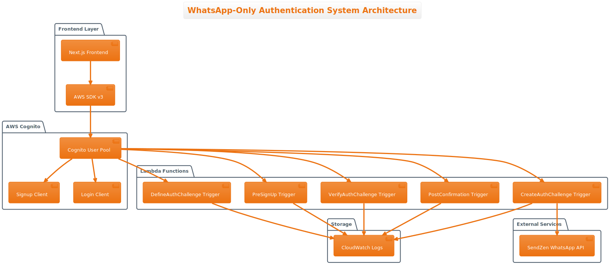

Click to expand PlantUML code

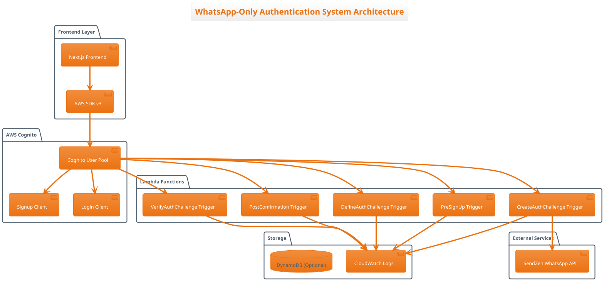

## Authentication Flow Diagram

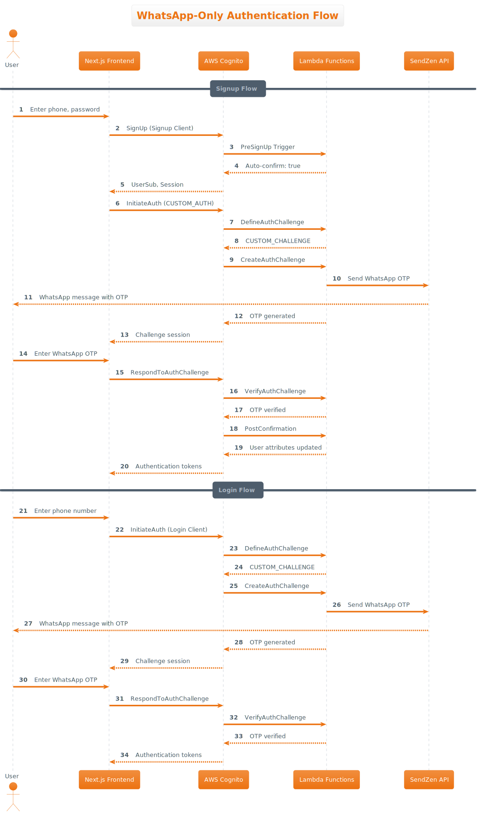

Click to expand PlantUML code

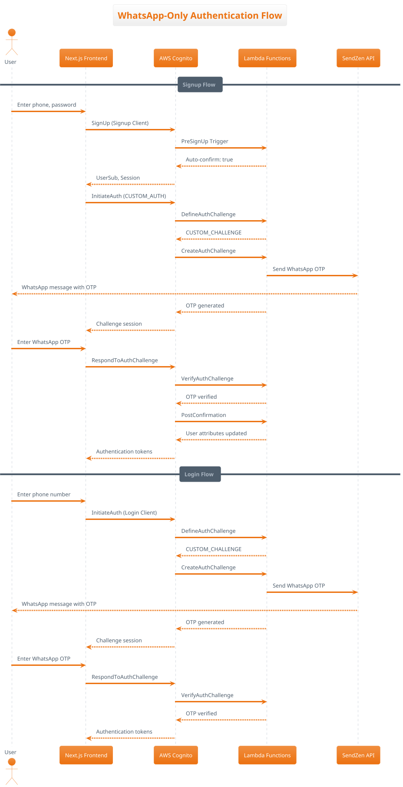

## Component Interaction Diagram

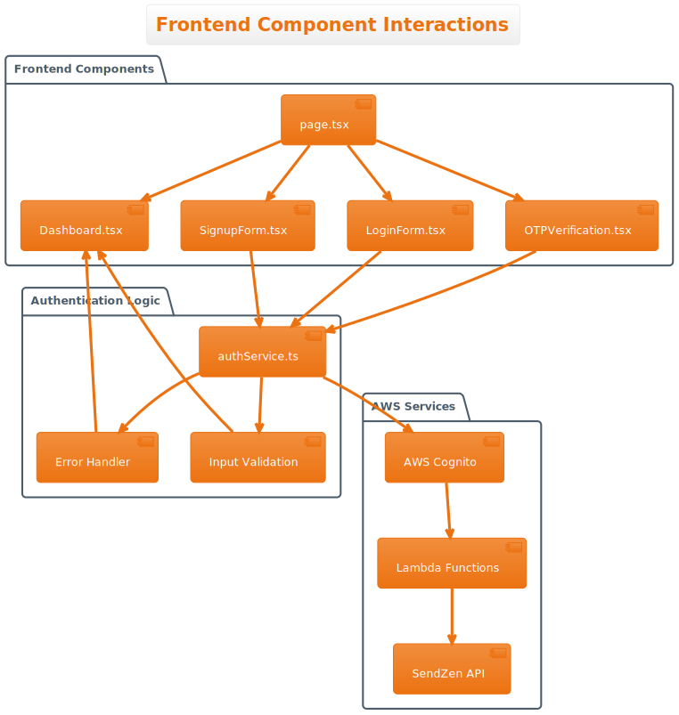

Click to expand PlantUML code

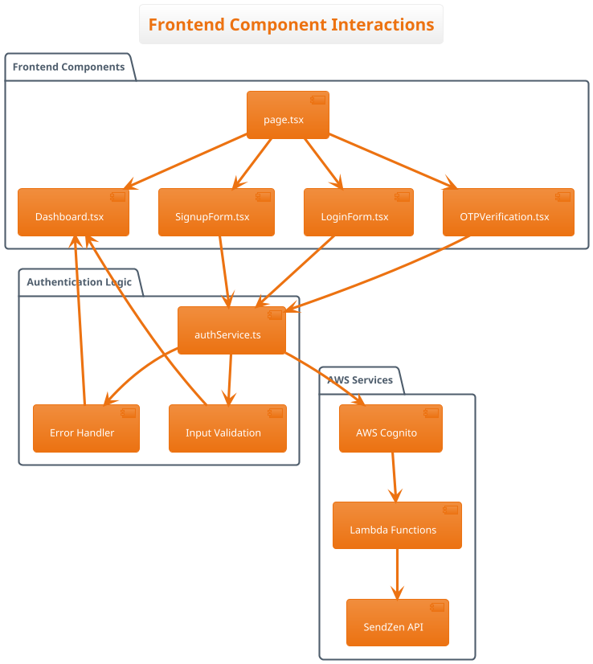

## User Experience Flow Diagram

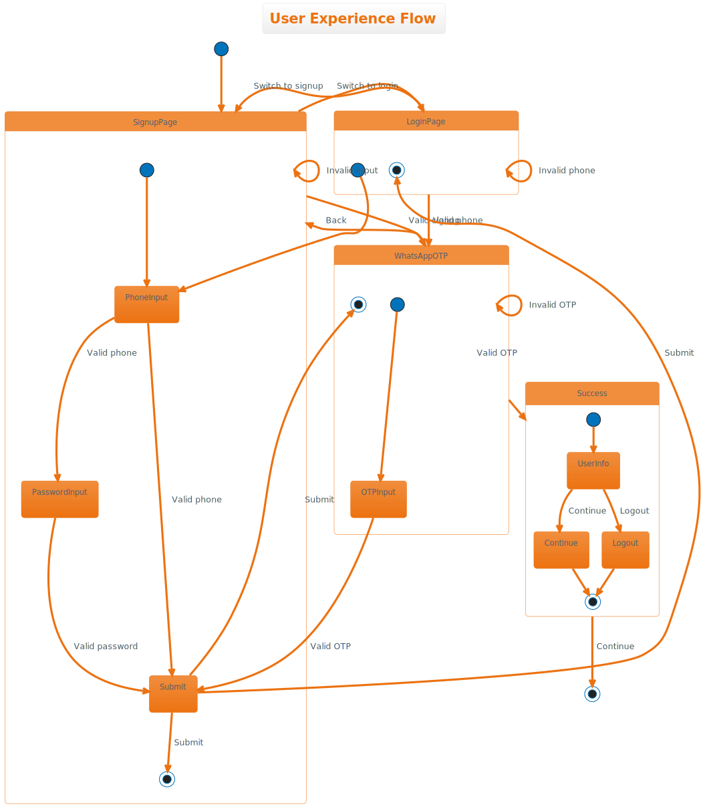

Click to expand PlantUML code

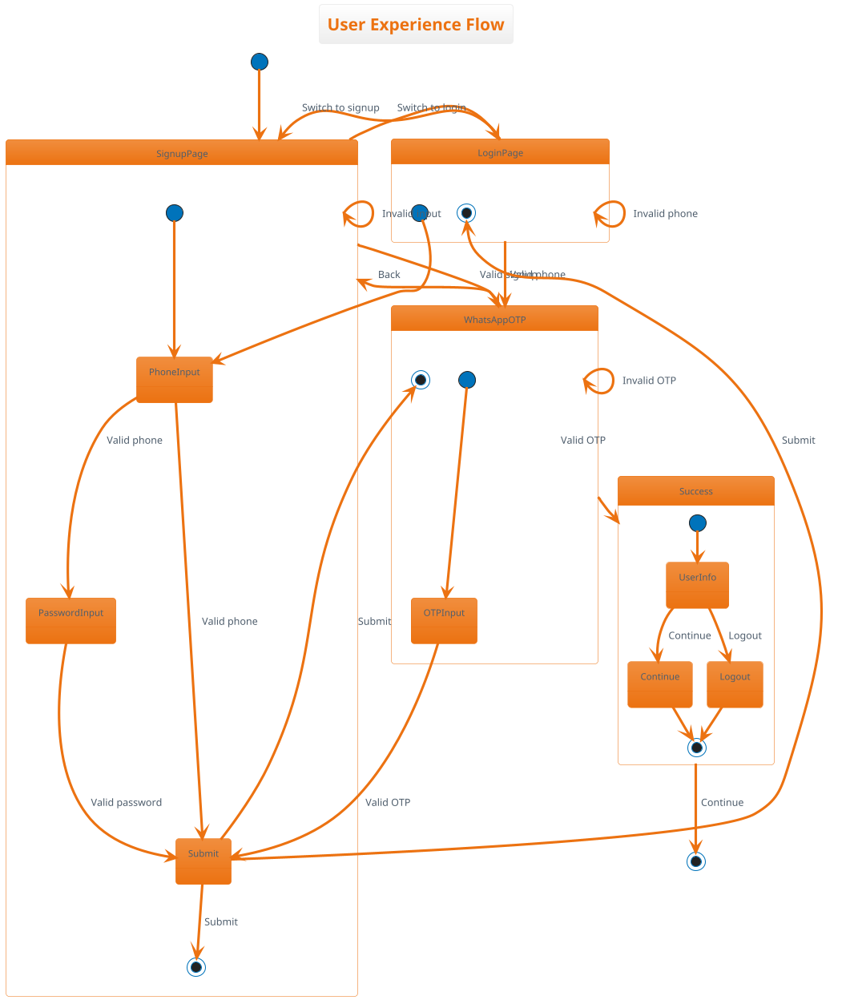

## Lambda Function Architecture

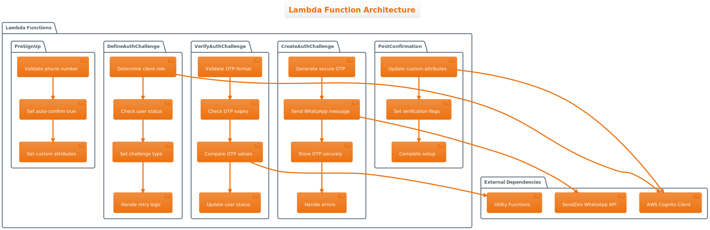

Click to expand PlantUML code

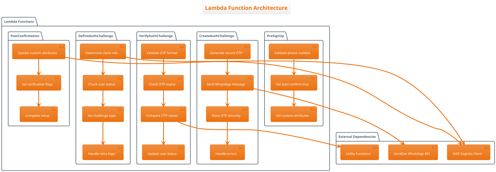

## Data Flow Diagram

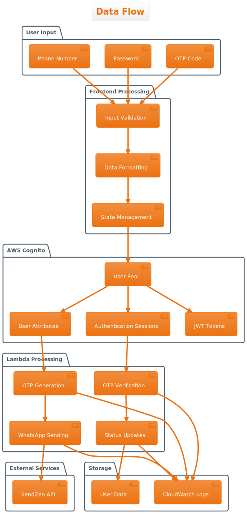

Click to expand PlantUML code

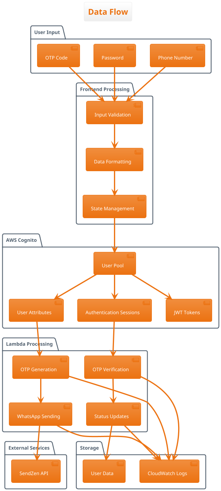

